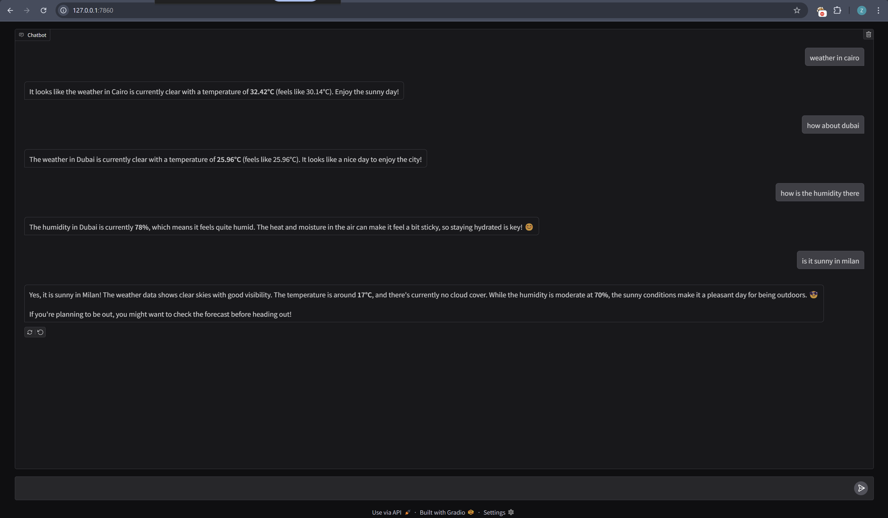
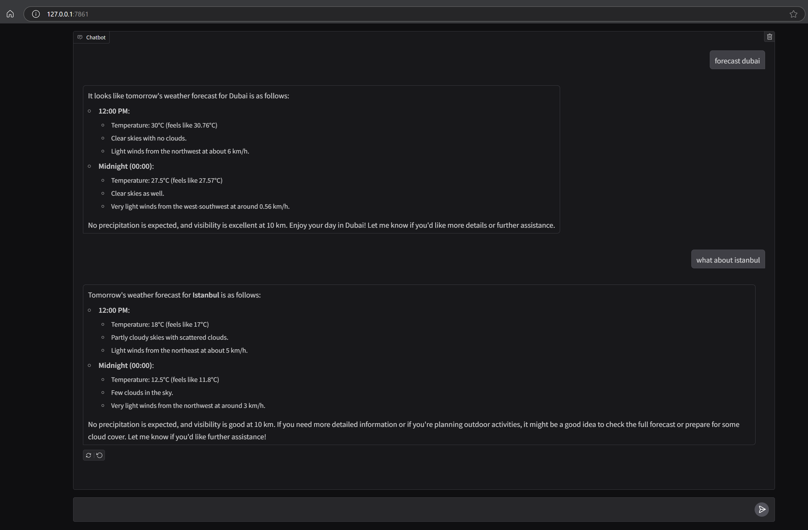

# 🌤️ WeatherAgent – LLM-Powered Weather Assistant

WeatherAgent is an intelligent weather query assistant built using [LangGraph](https://github.com/langchain-ai/langgraph), [Gradio](https://www.gradio.app/), and the [OpenWeather API](https://openweathermap.org/). It allows users to interactively ask about the **current weather** or the **forecast for tomorrow** (at noon or midnight) for any city, using natural language.

Under the hood, it uses a local [DeepSeek](https://deepseek.com/) LLM (`deepseek-r1:8b`) (which is a little dumb, ngl) to extract user intent and city from text, make the appropriate API call, and summarize results in a conversational tone.

---

## Features

- **LLM-driven intent extraction** – Detects if user wants current weather or a forecast
- **City recognition** from freeform user input
- **Tomorrow’s forecast** includes filtered entries for **00:00** and **12:00**
- **Local inference using LangChain + LangGraph**
- **Chat interface** powered by Gradio

---

## Installation

To run the program, first you need to install Ollama and then DeepSeek using the following commands (assuming a linux OS/WSL):
```bash
curl -fsSL https://ollama.com/install.sh | sh
ollama run deepseek-r1:8b
```
Now, you can clone the github and run the program:
```bash
git clone https://github.com/your-username/weather-agent.git
cd weather-agent
python3 -m venv .venv
source .venv/bin/activate
pip install -r requirements.txt
```
--- 

## .env Configuration
Create a `.env` file with your OpenWeather API key:
```dotenv
OPENWEATHER_API_KEY=your_openweather_api_key_here
```
--- 

## Running the App
```bash
python front.py
```
This will launch a Gradio interface at `http://127.0.0.1:7860/`.

---

## Example Queries

- “What’s the weather in Cairo?”
- “Forecast for tomorrow in Alexandria”
- “Is it going to be hot tomorrow at noon in Luxor?”

--- 
## Screenshots
### 📍 Current Weather Example


### 📆 Forecast Example


---

## 🛠️ Note
I used one day's data for the forecast only because the local DeepSeek model was too dumb to be able to parse the JSON and understand the data for more than one day, and I wanted to try out DeepSeek for this project. Originally, as you can see in the commit history, three days' data were sent to the LLM. 